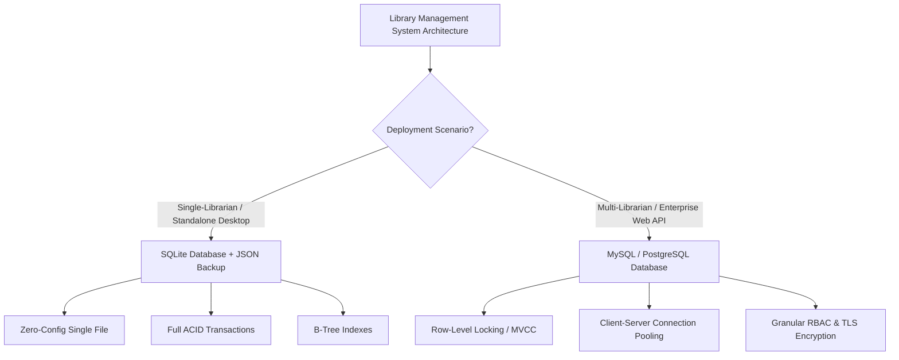

# Task 02 - Question 03: Storage Options Comparison & Selection

## Question 02 (High Level Prompt)
> **Compare JSON, CSV, SQLite, and MySQL as storage options for this project. Which one would you choose and why? Justify your answer based on scalability, performance, and security.**

---

## 1. Executive Summary & Storage Choice

For the Library Management System:

1. **For Single-Librarian Desktop Application (Question 01)**:
   - **Chosen Engine**: **SQLite**
   - **Why**: SQLite is zero-configuration, embedded, fully ACID-compliant, supports B-Tree indexes, and operates as a single local file (`library.db`). It provides fast in-process query execution with zero network latency. **JSON** is retained as an offline export/backup format (`library_backup.json`).

2. **For Multi-Librarian Concurrent Production System (Question 02 & Enterprise)**:
   - **Chosen Engine**: **MySQL / MariaDB** (or PostgreSQL)
   - **Why**: MySQL's **InnoDB engine** provides **row-level locking** and **Multi-Version Concurrency Control (MVCC)**, allowing hundreds of librarians across separate workstations to issue books, process returns, and record fines concurrently without lock contention (`database is locked`). MySQL also provides enterprise client-server connection pooling, TLS network wire encryption, granular Role-Based Access Control (RBAC), and master-slave replication.

3. **Why Flat Files (CSV / JSON) are Unsuitable as Primary Databases**:
   - Flat files lack ACID transactions, foreign keys, and indexing. A write operation requires rewriting the entire file ($O(N)$ overhead). Concurrent writes risk severe data corruption, lost updates, and race conditions.

---

## 2. In-Depth Comparative Evaluation

### A. Scalability
* **CSV (Flat File)**: Poor. Scans require reading line-by-line. No concurrent write support. Unsuitable for datasets over a few megabytes or multiple simultaneous users.
* **JSON (Hierarchical File)**: Poor. The entire JSON payload must be loaded into memory. Updating a single book forces full re-serialization and writing the entire file to disk ($O(N)$ write overhead).
* **SQLite (Embedded DB)**: Moderate to High. Handles gigabytes of data and millions of rows on a single host node. Supports unlimited concurrent readers via Write-Ahead Logging (`PRAGMA journal_mode=WAL;`), but locks the entire database during write operations, limiting high-concurrency writes.
* **MySQL (Client-Server RDBMS)**: Enterprise-Grade. Handles multi-terabyte databases and thousands of concurrent transactions. Built for client-server architecture with connection pools, master-replica replication, and clustering.

### B. Performance
* **CSV**: Read latency is $O(N)$ linear time (no indexes). Write latency for updates/deletes is very slow due to file re-writing.
* **JSON**: In-memory access is fast once loaded, but initial parse time and memory footprint scale linearly with dataset size. Every write requires full file re-serialization.
* **SQLite**: Sub-millisecond read latency due to zero-network socket calls (in-memory C library). B-Tree indexing on `isbn`, `title`, `author`, and `category` ensures $O(\log N)$ searches.
* **MySQL**: Ultra-fast (1–5ms) indexed queries supported by memory buffer pools and query caching. InnoDB row-level locking handles high transactional throughput under heavy concurrent write loads.

### C. Security & Access Control
* **CSV & JSON**: Zero built-in security. Relies entirely on host OS file permissions (`chmod`/NTFS). No user authentication, no row-level security, no network wire encryption. Raw user passwords/hashes exposed if file permissions are loose.
* **SQLite**: Protected against SQL injection via parameterized queries (`cursor.execute(sql, params)`). File encryption is supported via extensions (SQLCipher). Lacks native user management or granular RBAC since it runs in-process.
* **MySQL**: Enterprise RBAC. Allows defining distinct database roles (`librarian_role`, `admin_role`, `api_service`) with restricted table/column privileges. Enforces TLS/SSL wire encryption for remote connections, Transparent Data Encryption (TDE) at rest, and audit logging.

### D. Data Consistency & Integrity
* **CSV & JSON**: No ACID guarantees. No foreign keys, unique constraints, or transaction rollbacks. A crash mid-write results in file corruption.
* **SQLite**: Full ACID compliance. Strict Primary/Foreign Key enforcement (`PRAGMA foreign_keys = ON;`), transactions, and WAL mode prevent corruption during crashes.
* **MySQL**: Full ACID compliance via InnoDB. Configurable transaction isolation levels (`READ COMMITTED`, `REPEATABLE READ`, `SERIALIZABLE`), crash recovery via doublewrite buffers and redo logs.

---

## 3. Storage Comparison Matrix

| Criteria | JSON | CSV | SQLite | MySQL / MariaDB |
| :--- | :--- | :--- | :--- | :--- |
| **Data Model** | Document (Hierarchical) | Flat Tabular | Relational (SQL) | Relational (SQL) |
| **Architecture** | Local File | Local File | Embedded Database | Client-Server RDBMS |
| **Concurrency** | None (Race Conditions) | None (File Corruption) | Moderate (WAL Reads, Single Writer) | High (Row-Level Locking & MVCC) |
| **Read Performance** | $O(N)$ Parse Overhead | $O(N)$ Line Search | Sub-ms (B-Tree Indexing) | Fast (Buffer Pool & B-Tree) |
| **Write Performance**| $O(N)$ Rewrites Whole File | Fast Append / Slow Update | Fast Single-Thread / Lock Contention | High Throughput Concurrent Writes |
| **Data Integrity** | No ACID / No Foreign Keys | No ACID / No Constraints | Full ACID Compliance | Full ACID Compliance |
| **Security & RBAC**| OS File Permissions | OS File Permissions | OS File Security + SQLCipher | Granular RBAC, TLS, TDE, Audit Logs |
| **Maintenance** | Zero-Config | Zero-Config | Zero-Config (Single file) | Server Administration & Backups |

---

## 4. Architectural Recommendation & Decision Rationale

### Final Conclusion:
1. **Choose SQLite for Question 01** because it gives robust ACID compliance, structured indexing, zero-configuration setup, and high local speed without the overhead of running a database server daemon.
2. **Choose MySQL for Question 02 & Cloud/Web Deployments** because it solves multi-librarian concurrency through row-level locking, prevents connection locks, enforces enterprise security, and scales seamlessly across multiple library branches.
