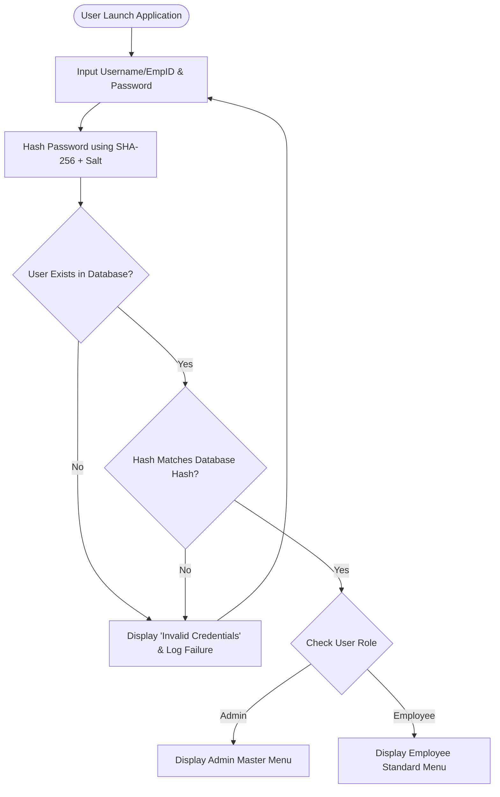
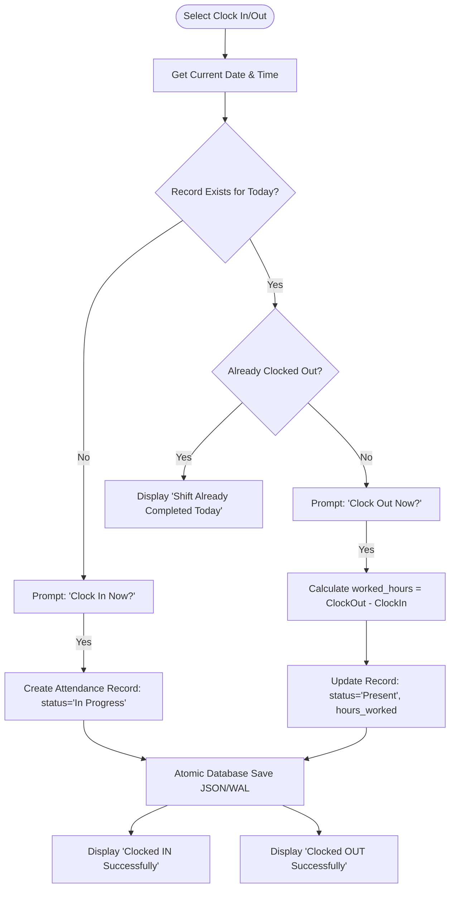
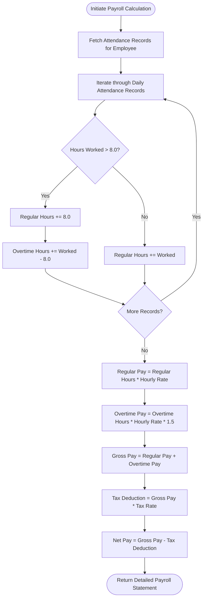
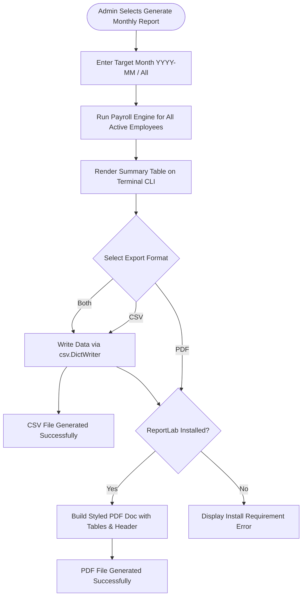
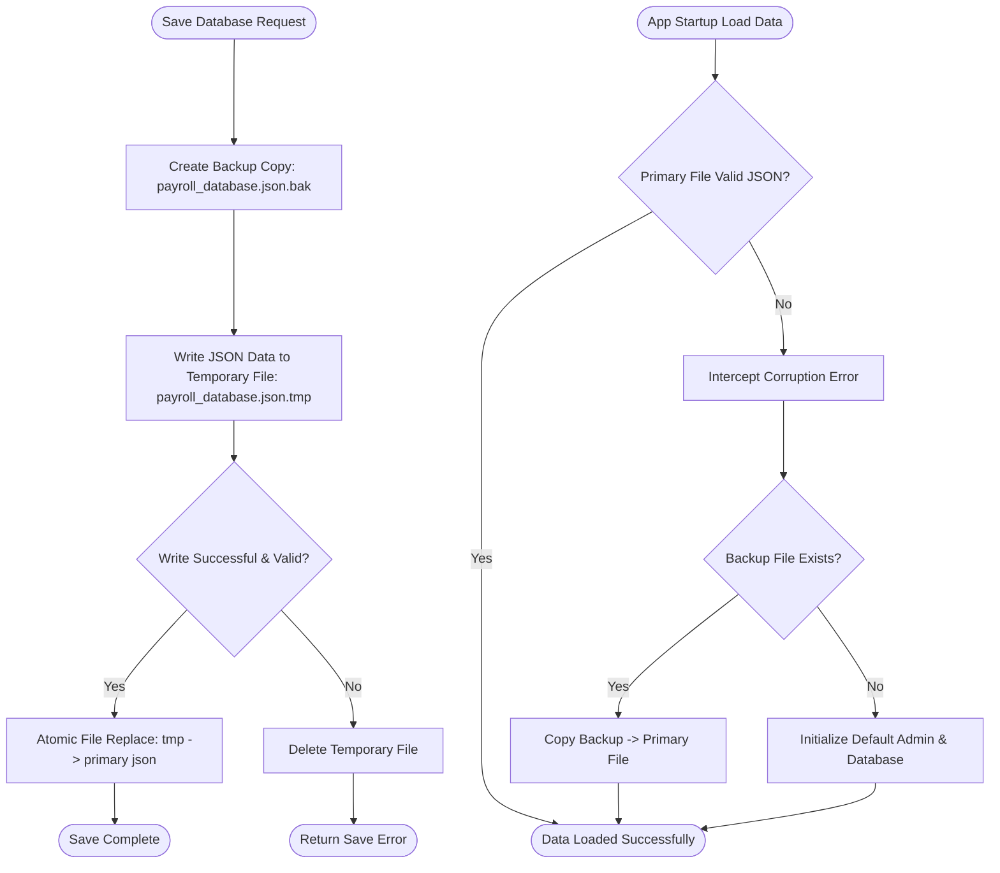

# APTURA TECH SOLUTIONS - SYSTEM FLOWCHARTS
**1-Month Internship Program – Batch 02 | Week 03 Task**  
**Module:** System Architecture & Workflow Visualizations  

---

## 1. EMPLOYEE & ADMIN AUTHENTICATION FLOW

---

## 2. ATTENDANCE MANAGEMENT (CLOCK IN / CLOCK OUT) FLOW

---

## 3. SALARY & OVERTIME CALCULATION ENGINE FLOW

---

## 4. REPORT GENERATION & EXPORT FLOW (CSV / PDF)

---

## 5. ATOMIC DATA WRITE & CORRUPTION RECOVERY FLOW

